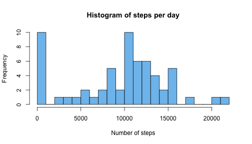

## Loading and preprocessing the data

```r
unzip("activity.zip")
data <- read.csv("activity.csv")
data$dd <- as.Date(data$date,format = "%Y-%m-%d") # making dates a Date format
```


## What is mean total number of steps taken per day?


```r
daily_steps <- with(data,tapply(steps,list(dd),sum, na.rm=TRUE))
hist(daily_steps,main="Histogram of steps per day",col="skyblue2",breaks = 20, xlab="Number of steps")
```

 

```r
mean(daily_steps, na.rm=TRUE)
```

```
## [1] 9354.23
```

```r
median(daily_steps, na.rm=T)
```

```
## [1] 10395
```

The mean value of the taken steps, excluding missing records is 9354.23 and the median value is 10395.

## What is the average daily activity pattern?


```r
ts.aggregated <- aggregate(data=data,steps~interval, FUN = mean, na.rm=TRUE)

plot(y=ts.aggregated$steps,x=ts.aggregated$interval, type="l", xlab="Interval", ylab="Average number of steps", col="skyblue2",lwd=4, main="Daily activity")
```

 

The day of the average maximum steps was recorded on 835. There are still some missing observations present, hence for selected days no steps were recorded at all. The pattern clearly shows the increase of the steps taken at the beginning of the day, and decreasing steadily from morning (8-9am) to the end of a day, with specific peaks around noon (lunch time?), and around 4pm, 5pm, and 6pm (going home?, it may depend on the type a job). Generally the activity pattern are clearly visible. 


```r
ts.aggregated[which(ts.aggregated$step==max(ts.aggregated$steps, na.rm=TRUE)),]
```

```
##     interval    steps
## 104      835 206.1698
```

The maximum number of steps on average across all days was observed on early morning: 8:35 am. 

## Imputing missing values

The number of missing values in the entire data-set is as high as the following:

```r
sum(is.na(data$steps))
```

```
## [1] 2304
```

The imputation of the values to replace missing values of the number of steps may be performed on the daily median/mean value. But first lets see the distribution of the daily medians and means on the entire data-set.


```r
med.aggregated <- with(data,tapply(steps,dd,median,na.rm=TRUE)) # daily median is always 0
mean.aggregated <- with(data,tapply(steps,dd,mean,na.rm=TRUE))
sum(is.na(med.aggregated))
```

```
## [1] 8
```

```r
sum(is.na(mean.aggregated))
```

```
## [1] 8
```

Based on the daily aggregation, even if we remove missing variables, for specific dates there are still some missing observations for the entire day, hence this method may yield some issues if we use the daily aggregation as a base for the missing value imputation. Moreover, daily medians are always 0 in this data-set. Since each day pattern may look similar, it may be better to use *interval* id as an aggregation index. Considering skeweness of the steps distribution, median could a better choice for the imputation.


```r
b <- with(data,tapply(steps,interval,median,na.rm=TRUE))
hist(b, col="skyblue2", main="Distribution of interval medians")
```

 

```r
sum(is.na(b)) # count of the missing observations
```

```
## [1] 0
```

The imputation was made with the following code:


```r
new_data <- data
steps <- is.na(data$steps)
dummy <- rep(NA,length(steps))
for (i in 1:length(dummy)){ 
  dummy[i] <- b[as.character(data[i,"interval"])]
}
new_data[,"steps"] <- ifelse(steps,dummy,data$steps) 

new_daily_steps <- with(new_data,tapply(steps,list(dd),sum, na.rm=TRUE))
hist(new_daily_steps,main="Histogram of steps per day (with imputed data)",col="skyblue2",breaks = 20, xlab="Number of steps")
```

 

```r
mean(new_daily_steps, na.rm=TRUE)
```

```
## [1] 9503.869
```

```r
median(new_daily_steps, na.rm=T)
```

```
## [1] 10395
```

The mean value of the taken steps, excluding missing records is 9354.23 and the median value is 10395. in the new data-set after the imputation of the missing observations the mean and the median have values of 9503.87 and 10395 respectively. Only the mean value  slightly changes. 


## Are there differences in activity patterns between weekdays and weekends?


```r
new_data$wkd <- ifelse(weekdays(new_data$dd)%in%c("Saturday","Sunday"),"Weekend","Weekdays")
w.aggregated <- aggregate(data=new_data,steps~interval+wkd,mean,na.rm=TRUE)
library(lattice)
xyplot(data=w.aggregated,steps~interval|wkd, type="l", col="skyblue2", lwd=3, layout = c(1,2))
```

 

There is a difference in activity pattern. On weekends the activity looks roughly consistent throughout a day, on the other hand, on weekdays, the highest numbers of steps are observed for the intervals between 8-9 am, when during the rest of the day are significantly lower. 
